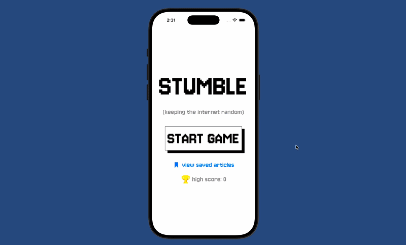

# STUMBLE
**stumble is an app making the internet feel random again**
 
*created under Carolina App Team*

Search engines and AI assistants are great at giving answers, but they've removed one of my favorite parts of using the web: wandering. Last month, I realized I wasn't clicking through random pages anymore, interesting links, or finding obscure. My favorite part about being online was going down Internet rabbit holes, but we've lost it.

Each round, you're shown an image from a random Wikipedia article and have to match it to the correct title from three choices. Save interesting discoveries and dive down rabbit holes whenever curiosity strikes.

**tech stack**
<li>Wikipedia API</li>
<li>Swift</li>
<li>SwiftUI</li>
